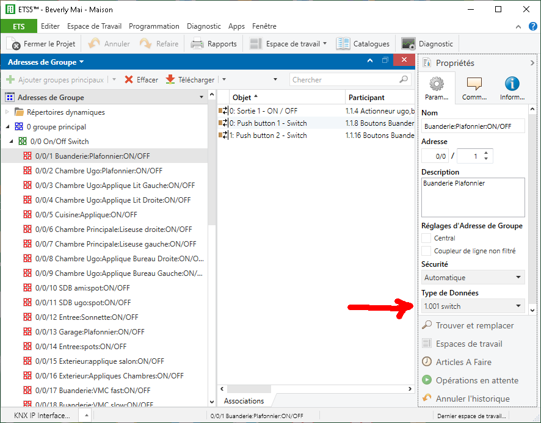

# ETS project file to Home Assistant configuration

A Ruby tool to convert an ETS5 project file (`*.knxproj`) into:

* a YAML configuration file suitable for **Home Assistant** (requires to define building, functions and group datapoints in ETS)
* an XML file for `linknx` (the object list only)

[https://www.home-assistant.io/integrations/knx/](https://www.home-assistant.io/integrations/knx/)

## Glossary

**KNX Group Address**: a group address is a 1, 2 or 3-level address in the KNX system, e.g. `1/2/3.
**KNX Data Point Type**: a data point type is a type of data that can be sent on a group address, e.g. **1.001**, **5.001**.
**ETS Building Information**: In ETS, a building is a container for rooms and **ETS Function**.
**ETS Function** : In ETS, represents an object that has several **KNX Group Address** associated to it.
**HA Device** : In Home Assistant, a device has a type (e.g.`light`) and has **HA Config Variable**.
**HA Config Variable** : In Home Assistant, it's a property of a device, e.g.`name`,`address`,`state_address`.

## Important note

In order for the tool to generate result properly read the following.

An actionable entity in KNX is a **KNX Group Address**: commands are exchanged in a group address on the KNX Bus.
For example a dimmable light has at least one group address for On/Off and another for the dimming value.

Actionable entities in **Home Assistant** are **HA Device**.
For example, a dimmable light is a device and has properties, one of them is the group address for On/Off and another is the group address for the dimming value.

So, for the tool to work, the following pieces of information must be found:

* **KNX Group Address**
* **KNX Data Point Type** for each **KNX Group Address**
* Grouping of group addresses into devices : **ETS Function** in ETS mapped to **HA Device** in Home Assistant

By default, and in fact in a lot of ETS projects, only group addresses are defined as this is sufficient for an installation.
I.e. no functions are defined, and data point types are not defined for group addresses.
This is why this tool will not work out of the box most of the times: missing information.
The next 2 sections explain how to fix this.

### Group address: Type

**KNX Group Address**es are defined in the ETS project file naturally, as it is the base for the system to work.
But we need the types of them (e.g. **on/off** versus **dim value**) in order to create the HA configuration.

The best, easiest and most reliable way for the tool to find the **KNX Data Point Type** is to specify the **KNX Data Point Type** in the group address itself in ETS.
This requires editing the KNX project.
Refer to [Structure in ETS](#structure-in-ets).

Another possibility is to create a custom script.
Refer to [Custom method](#custom-method)

### Group address: Grouping into devices

The second part is to regroup **KNX Group Address**es into **HA Device**.
This is best done by creating **ETS Function** in ETS.
Refer to [Structure in ETS](#structure-in-ets).

Another possibility is to create a custom script.
Refer to [Custom method](#custom-method)

## Installation

[Install Ruby for your platform](https://www.ruby-lang.org/fr/downloads/):

* Linux: builtin (yum, apt), or [RVM](https://rvm.io/), or [rbenv](https://github.com/rbenv/rbenv)
* macOS: builtin, or [RVM](https://rvm.io/), or [brew](https://brew.sh/), or [rbenv](https://github.com/rbenv/rbenv)
* Windows: [Ruby Installer](https://rubyinstaller.org/)

Clone this repo: (or download zip file)

```bash
git clone https://github.com/laurent-martin/ets-to-homeassistant.git
````

Install required gems (`xml-simple`, `rubyzip`):

```bash
cd ets-to-homeassistant

gem install bundler

bundle install
```

> **Note:** On windows make sure that the file `Gemfile` is not renamed `Gemfile.txt`

## Usage

Once Ruby is installed and this repo cloned, change directory to the main folder and execute `./bin/ets_to_hass`:

General invocation syntax:

```bash
Usage: ./bin/ets_to_hass [--format format] [--specific specific.rb] [--addr addr] [--trace trace] [--ha-knx] [--full-name] <etsprojectfile>.knxproj

-h, --help:
 show help

--format [format]:
 one of homeass|linknx

--specific [specific.rb]:
 file with specific code to process the ETS project

--addr [addr]:
 one of Free, TwoLevel, ThreeLevel

--trace [trace]:
 one of debug, info, warn, error

--ha-knx:
 include level knx in ouput file

--full-name:
 add room name in object name
```

For example to generate the home assistant KNX configuration from the exported ETS project: `myexport.knxproj`

```bash
./bin/ets_to_hass --format homeass --full-name myexport.knxproj > ha.yaml
```

Option `--ha-knx` adds the dictionary key `knx` in the generated Home Assistant configuration so that it can be copy/paste in `configuration.yaml`.
Else, typically, include the generated entities in a separate file like this:

```yaml
knx: !include config_knx.yaml
```

Default special processing code is used if none is provided.
It will generate basic Objects/Functions for group addresses not part of a function.

The generated result is displayed on terminal (STDOUT), so to store in a file, redirect using `>`.

Logs are sent to STDERR.

## Internal logic

The tool takes the exported file from ETS with extension: `knxproj`.
The project file is a zip with several XML files in it.
Make sure that the project file is not password protected.

* The tool parses the first project file found.
* It extracts **ETS Building Information** and **KNX Group Address**es.
* A Ruby object of type: `EtsToHass` is created.

  The property `data` of the object contains the project data and is structured like this:

  `ga` contains all **KNX Group Address**es, `_gaid_` is the internal identifier of the **KNX Group Address** in ETS

  `ob` contains all **ETS Function**, `_obid_` is the internal identifier of the **ETS Function** in ETS

```ruby
{
 ga:{
  _gaid_ => {
   name:             "from ETS",
   description:      "from ETS",
   address:          group address as string. e.g. "x/y/z" depending on project style,
   datapoint:        datapoint type as string "x.abc", e.g. 1.001,
   objs:             [list of _obid_ using this group address],
   custom:           {custom values set by specific code: ha_address_type, linknx_disp_name }                                            # 
  },...
 },
 ob:{
  _obid_ => {
   name:   "from ETS, either function name or full name with room if option --full-name is used",
   type:   "ETS function type, see below",
   floor:  "from ETS",
   room:   "from ETS",
   ga:     [list of _gaid_ included in this object],
   custom: {custom values set by specific code: ha_init, ha_type}
  },...
 }
}
```

* the custom specific code is called giving an opportunity to modify this structure

* Eventually, the HA configuration is generated

## Structure in ETS

The **KNX Data Point Type** of **KNX Group Address** is used to find out the associated **HA Config Variable**.
In ETS, for each **KNX Group Address**, make sure to define the **KNX Data Point Type** as in the following screenshot:



**ETS Building Information** and **ETS Function** are used to generate HA devices.
If the ETS project has no **ETS Building Information**, then the tool will create one **HA Device** per **KNX Group Address**.

In the following screenshot, note that both **KNX Group Address** and **ETS Function** are created.


Moreover, if **ETS Function** are located properly in **ETS Building Information** levels and rooms, the tool will read this information.

When **ETS Function** are found, the tool will populate the `ob` `Hash`.

The type of **ETS Function** is identified by a name (in ETS project file it is `FT-[n]`):

* `:custom`
* `:switchable_light`
* `:dimmable_light`
* `:sun_protection`
* `:heating_radiator`
* `:heating_floor`
* `:heating_switching_variable`
* `:heating_continuous_variable`

## Custom method

If the **KNX Data Point Type** of a **KNX Group Address** is not defined in the ETS project, then the tool cannot guess which group address is e.g. for On/Off, or for dimming value.

If no **ETS Building Information** with **ETS Function** was created in the project, then the tool cannot guess which set of **KNX Group Address** refer to the same **HA Device**.

It is possible to add this information using option `--specific` (custom script) which can add missing information, based, for example, on the name of the **KNX Group Address**.

For example, I used to use a naming convention like: `<room>:<object>:<type>` before using ETS features, and the custom script could guess the missing data type from `<type>`, and then group addresses into devices based on `<room>` and `<object>`.

But if the convention is to place `ON/OFF` in `1/x/x` then you can use the first address identifier to guess the type of **KNX Group Address**.

The specific code can modify the analyzed structure:

* It can delete objects, or create objects.
* It can add fields in the `:custom` properties:

  * in `ga`:
    * `ha_address_type` : define the use for the group address
    * `linknx_disp_name` : set the description of group address in `linknx`
  * in `ob`:
    * `ha_type` : force the entity type in HA (switch, light, etc.)
    * `ha_init` : initialize the HA object with some values

The function can use any information such as fields of the object, or description or name of group address for that.

Typically, the name of group addresses can be used if a specific naming convention was used.
Or, if group addresses were defined using a specific convention: for example in a/b/c a is the type of action, b is the identifier of device...

The specific code shall be like this:

```ruby
class EtsToHass
  def apply_specific
    @logger.info('Applying custom code: xxx')
    # use @data to modify the structure
  end
end
```

## Linknx

`linknx` does not have an object concept, and needs only group addresses.

## XKNX

Support is dropped for the moment, until needed, but it is close enough to HA.

## Reporting issues

Include the version of ETS used and logs.

## TODO

One possibility would be to add extra information in the description of the group address and/or function in ETS, and then parse it in the tool.
