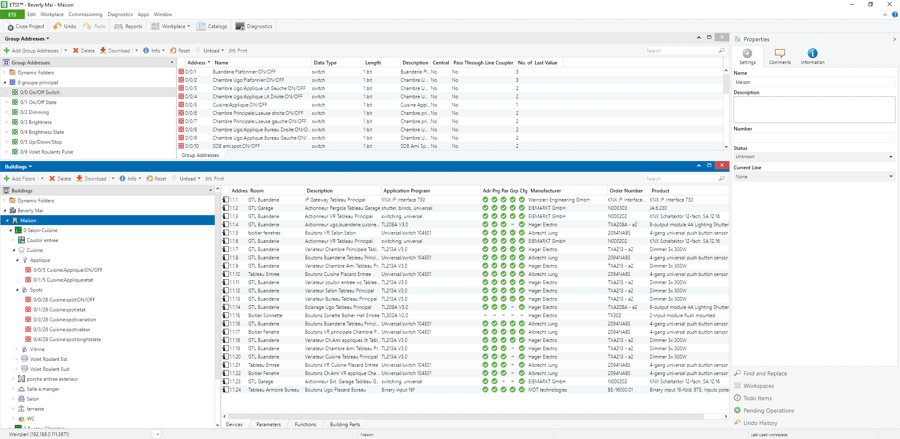

# ets-to-homeassistant

A Ruby script to convert an ETS5 project file (*.knxproj) into:

* a YAML configuration file suitable for Home Assistant (requires to define the building and functions in ETS)
* an XML file for linknx (the object list only)

[https://www.home-assistant.io/integrations/knx/](https://www.home-assistant.io/integrations/knx/)

## Usage

Install Ruby for your platform (Windows, macOS, Linux), install required gems (xmlsimple, zip).

```
./ets_to_hass.rb <homeass|linknx> <input file> [<special processing lambda>]
```

Set env var DEBUG to one of: debug, info, warn, error (default is info)

Set env var GADDRSTYLE to Free, TwoLevel, ThreeLevel to override project group address style.
    
## Structure in ETS

The script takes the exported file with extension: `knxproj`.
This file is a zip with several XML files in it.
The script parses the first project file found.
It extracts group address information, as well as Building information.

<p align="center"><br/>Fig. 1 ETS 5 with building</p>

## Home Assistant

In building information, "functions" are mapped to Home Assistant objects, such as dimmable lights, which group several group addresses.

So, it is mandatory to create functions in order for the script to find objects.

## Linknx

`linknx` does not have an object concept, and needs only group addresses.

## XKNX

Support is dropped for the moment, until needed.

## Special processing

Once the project file has been parsed, an object of type: `ConfigurationImporter` is created with property: `data`. structured like this:

```
{
	ob:{
		_obid_ => {
			name:   "from ETS",
			type:   "object type, see below",
			floor:  "from ETS",
			room:   "from ETS",
			ga:     [list of included group addresses identifiers],
			custom: {custom values set by lambda: ha_init, ha_type}
		},...
	},
	ga:{
		_gaid_ => {
			name:             "from ETS",
			description:      "from ETS",
			address:          group address as string. e.g. "x/y/z" depending on project style,
			datapoint:        datapoint type as string "x.00y",
			objs:             [list of objects ids with this ga],
			custom:           {custom values set by lambda: ha_address_type, linknx_disp_name }                                            # 
		},...
	}
}
```

types include:

```
:custom,:switchable_light,:dimmable_light,:sun_protection,:heating_radiator,:heating_floor,:heating_switching_variable,:heating_continuous_variable
```

It is possible to provide a post-processing function that can modify the analyzed structure.

The function may delete objects, or create objects.

The function can add fields in the `:custom` properties which can:

- `ha_init` : initialize the HA object with some values
- `ha_type` : force the entity type in HA
- `ha_address_type` : define the use for the group address
- `linknx_disp_name` : set the descriptio  of group address in linknx

The function can use any information such as fields of the object, or description or name of group address for that.

The function is called with the `ConfigurationImporter` as argument, from which property `data` is used.
